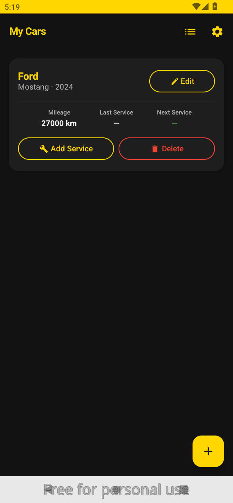
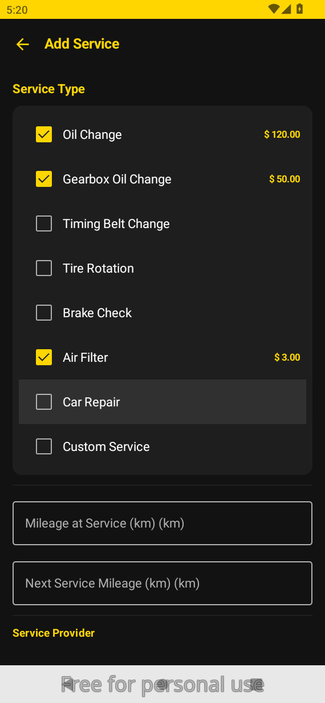
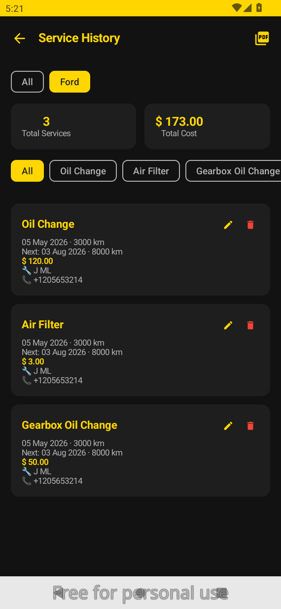
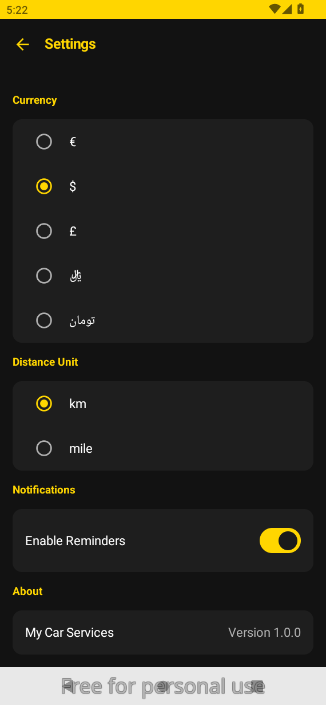

# 🚗 My Car Services

> Track, maintain, and drive safe — your offline car service manager.

---

## Screenshots

| Home | Add Service | Reports | Settings |
|------|-------------|---------|----------|
|  |  |  |  |

---

## Features

- **Multi-car support** — add and manage multiple vehicles
- **Service tracking** — oil change, gearbox oil, timing belt, tire rotation, brake check, air filter, car repair, and custom services
- **Checkboxes + per-service pricing** — select multiple services in one visit, each with its own cost
- **Service history** — full timeline per car with dates, mileage, cost, provider info, and notes
- **PDF export** — export a car's complete service history as a PDF to your Downloads folder
- **Smart notifications** — WorkManager checks daily and notifies you when a service is due
- **Car & service photos** — attach images from your gallery to cars and service records
- **Edit & delete** — update car info or service records anytime, delete with confirmation
- **Jalali calendar** — dates automatically shown in Jalali when Persian language is selected
- **3 languages** — English, Deutsch, فارسی (with full RTL layout support)
- **Currency & distance unit** — choose your preferred currency (€ $ £ ﷼ تومان) and distance unit (km / mile) on first launch
- **Yellow & Black theme** — bold dark UI with yellow accents throughout
- **100% offline** — all data stored locally using Room database, no internet required

---

## Tech Stack

| Layer | Technology |
|-------|-----------|
| UI | Jetpack Compose + Material 3 |
| Navigation | Navigation Compose |
| Database | Room (local, offline) |
| DI | Hilt |
| Background | WorkManager |
| Image loading | Coil |
| Language | Kotlin |
| Min SDK | 26 (Android 8.0) |

---

## Project Structure

```
app/src/main/
├── kotlin/com/hbazai/mycarservices/
│   ├── data/
│   │   ├── local/         # Room DB, DAOs, Entities
│   │   └── repository/    # CarRepository, ServiceRepository
│   ├── di/                # Hilt modules
│   ├── navigation/        # NavGraph, Screen routes
│   ├── notification/      # ServiceCheckWorker
│   ├── screens/           # All Compose screens
│   ├── ui/theme/          # Colors, Typography, Theme
│   ├── util/              # LocaleHelper, JalaliCalendar, DateFormatter, PdfExporter
│   └── viewmodel/         # HomeViewModel, ServiceViewModel, ReportViewModel
└── res/
    ├── values/            # English strings
    ├── values-de/         # German strings
    └── values-fa/         # Persian strings
```

---

## Build & Install

```bash
# Debug build
./gradlew assembleDebug

# Release build (requires keystore)
./gradlew assembleRelease
```

APK output: `app/build/outputs/apk/`

---

## First Launch

On first launch the app will ask you to select:
- **Currency** — used across all cost fields and reports
- **Distance unit** — km or mile, used across all mileage fields

These can be changed anytime in **Settings**.

---

## License

MIT License — feel free to use and modify.